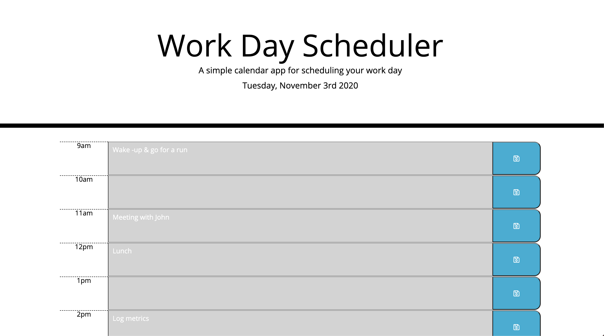

# DayPlanner
Creating a Day Planner practicing jQuery and moment.js.

## Third-Party APIs

This assignment is all about using third-party APIs to help create a Day Planner.

The magic happens all within the $(document).ready(function() {}) where jQuery is used to create all the elements on the page. This ranges from calling on moment.js to display the date to even creating each div of a timeslot. 

Users are then able to write in each timeslot, where the info is to be stored into localstorage. If users were to refresh the page, their info will still remain where they wrote it. 

Users are also able to see which slot is in the past, future or even current hour.

Plan your day using the link below!

**You can find a link to here!** - https://keithyyy.github.io/DayPlanner/

**Here's screenshots of the planner in action:**

